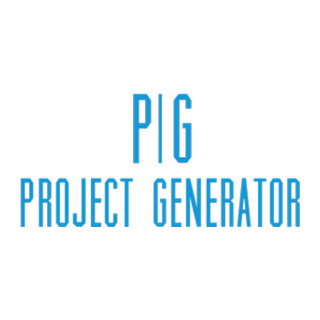

> Herramienta para generar proyectos a traves de templates configurables a traves de plugins

---

## Indice

* [Para empezar](#para-empezar)
* [Prerrequisitos](#prerrequisitos)
* [Despliegue](#despliegue)
* [Parametros](#parametros)
* [Configuracion](#configuracion)
* [Plugins](plugins.md)
* [Autor](#autor)

---


## Para empezar

Clonar el proyecto de git o descargar en archivo .zip/.tar.gz y descomprimir


## Prerrequisitos

- python 3.8 o superior


## Despliegue

En primera instancia es necesario tener las dependencias instaladas, estas se instalan de la sig. manera:
```
pip install -r requirements.txt
```

Tambien se puede correr con docker con el siguiente comando: 
```
docker pull alexiscaspell/project-generator-bash
docker run -it -v `pwd`:`pwd` alexiscaspell/project-generator-bash $(pwd)
```

Para levantar el proyecto solo es necesario ejecutar:
```
python negro_dame.py unNombreDeProyecto unPath
```

## Parametros

- Como primer parametro se le pasa el nombre del proyecto (obligatorio).
- Como segundo parametro se le pasa el path donde sera creado el proyecto (opcional).

## Configuracion

En ./generators/configuracion.json se puede configurar las opciones principales del generador, para configurar los plugins hacerlo desde ./plugins/nombreDelPlugin/[configuracion.json](plugins.md).

- **path_plugin_principal**: Es el path en el cual se encuentra el plugin base, osea el template que se usara como proyecto principal.
- **ejecutar_plugin_principal_al_inicio**: Indica si se debe ejecutar el plugin principal antes que los demas plugins o despues.
- **plugins**: Es una lista con los nombres de todos los plugins de los cuales se podra disponer (no hace falta poner el base), los nombres de estos deben de respetar los nombres de las carpetas en la carpeta ***plugins***.
- **variables**: Lista de nombres de variables que se podran usar en cualquier plugin a traves de ***@@nombreDeVariable*** (por default estan nombre_proyecto y path_proyecto), estas variables se deben disponibilizar de la siguiente manera:

    ```
    yeoman_handler.configuracion.agregar_variable("nombreDeVariable");
    ```

## Autor

> **Alexis Taberna**

* DockerHub: [alexistaberna](https://hub.docker.com/u/alexiscaspell)
