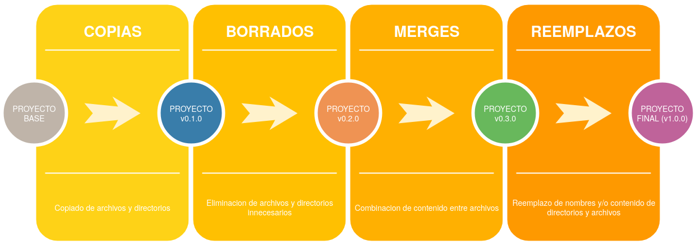

# Plugins

> Los plugins son templates de los cuales siempre se componen por una carpeta proyecto con todos los archivos necesarios de este, un archivo configuracion.json donde esta la configuracion del plugin y un index.js donde se puede extender las funcionalidades del plugin.

---

## Indice

* [Configuracion](#configuracion)
* [Menues](#menues)
* [Merges](#merges)
* [Copias](#copias)
* [Borrados](#borrados)
* [Reemplazos](#reemplazos)
* [Aclaraciones](#aclaraciones)

---

## Configuracion

En configuracion.json se detalla la configuracion de cada plugin, esta se compone de los elementos demostrados a continuacion:

## Menues
Los menues son elementos graficos que se muestran al usuario para que pueda configurar cosas especificas del plugin en runtime, se componen por **texto** que es el texto que se muestra en consola, **default** que es el valor default que toma la variable y **resultado** que es el nombre de la varaible en la cual se seteara el valor introducido el cual puede ser accedido dessde cualquier lado como ***@@unaVariable***. 

Un ejemplo seria:
```
    "menues": [
        {
            "texto": "Ingrese el valor de la variable:",
            "resultado": "unaVariable",
            "default": "valorDefault"
        }]
```

## Merges
Estos sirven para extraer texto de algun archivo y pegarlo en alguna parte del otro. 

Se componen de:
- **archivo_desde**: Path del archivo desde el cual se va a copiar el contenido, este es relativo a la ruta donde esta el generador de proyectos.
- **archivo_hasta**: Path del archivo al que se quiere agregar el texto extraido, este path es relativo a la ruta del proyecto que se esta creando.
- **despues_de**/**antes_de**: Se puede usar cualquiera de estos dos para especificar desde donde se quiere apendear el texto.
- **separador**: Es el caracter o caracteres que separan el texto introducido con el ya existente en el archivo.
- **reemplazar**: A veces es necesario reemplazar determinada ocurrencia con el texto extraido en vez de apendear/concatenar el texto.

Un ejemplo seria:
```
        "merges": [
        {
            "archivo_desde": "plugins/redis/proyecto/src/main/resources/template-redis.properties",
            "archivo_hasta": "src/main/resources/rest.properties",
            "despues_de": "#CONFIGURACION\n",
            "separador": "\n",
            "reemplazar": false
        }]
```

## Copias
Simplemente hacen esto, copian un archivo de una ubicacion a otro.

Se componen de:
- **path_desde**: Path del archivo o directorio del cual se va a copiar, este es relativo a la ruta donde esta el generador de proyectos.
- **path_hasta**: Path al cual se copiara el contenido, este path es relativo a la ruta del proyecto que se esta creando.
- **mover**: Por default esta en **false**, si esta en true en vez de copiar realiza un move (equivalente a un copy y un delete).

Un ejemplo seria:
```
"copias": [
        {
            "path_desde": "plugins/redis/proyecto/src/main/java/io/moorea/utils/redis",
            "path_hasta": "src/main/java/io/moorea/utils/redis",
            "mover":false
        }]
```

## Borrados
Permiten eliminar archivos o carpetas.

Se componen de:
- **path**: Path a borrar, este path es relativo a la ruta del proyecto que se esta creando.

Un ejemplo seria:
```
"borrados": [
        {
            "path": "src/main/java/ar/org/leafnoise/template"
        }
    ]
```

## Reemplazos
Estos sirven para extraer texto de algun archivo y pegarlo en alguna parte del otro. 

Se componen de:
- **paths**: Lista de paths a los cuales se analizara para reemplazar nombres o contenido, estos son relativos a la ruta donde esta el generador de proyectos.
- **regex**: Expresion regular que servira para seleccionar que archivos o directorios seran modificados.
- **texto**: Texto por el cual se reemplazara la ocurrencia del regex.
- **tipo**: Es el tipo de reemplazo que se esta haciendo, existe ***"nombre"*** (el cual modifica los nombres de archivos y directorios), ***contenido*** (Modifica solo el contenido de los archivos) y ***todo*** (reemplaza tanto contenido como nombres, ***este es el valor default***).

Un ejemplo seria:
```
"reemplazos": [
        {
            "paths": [
                "src/main"
            ],
            "regex": "template-redis",
            "texto": "@@nombre_proyecto",
            "tipo": "contenido"
        }]
```

# Aclaraciones
- La ejecucion de los elementos del plugin se realizan en el siguiente orden: 



